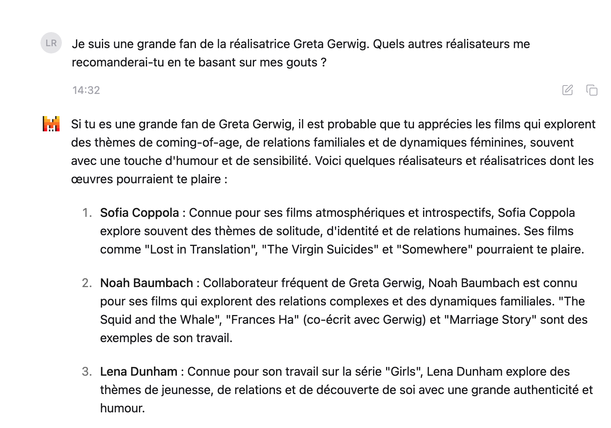
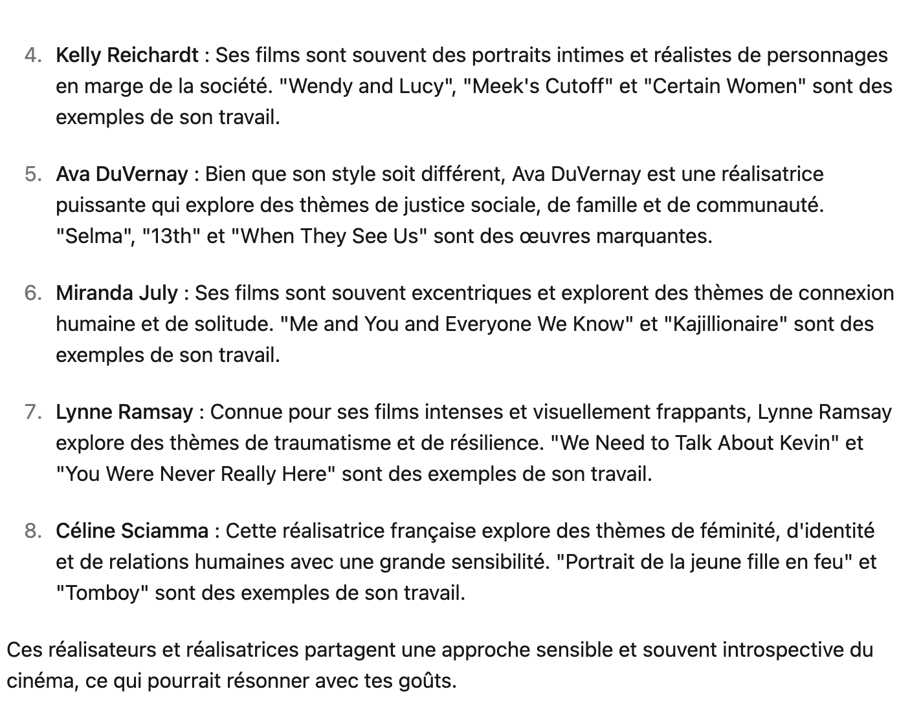

# Rendu IA : Mistral AI

## Recommandations de films :




JSON :

```javascript
[
    {
        "nom": "Sofia Coppola",
        "films": [
            "Lost in Translation",
            "The Virgin Suicides",
            "Somewhere"
        ]
    },
    {
        "nom": "Noah Baumbach",
        "films": [
            "The Squid and the Whale",
            "Frances Ha",
            "Marriage Story"
        ]
    },
    {
        "nom": "Lena Dunham",
        "films": [
            "Girls"
        ]
    },
    {
        "nom": "Kelly Reichardt",
        "films": [
            "Wendy and Lucy",
            "Meek's Cutoff",
            "Certain Women"
        ]
    },
    {
        "nom": "Ava DuVernay",
        "films": [
            "Selma",
            "13th",
            "When They See Us"
        ]
    },
    {
        "nom": "Miranda July",
        "films": [
            "Me and You and Everyone We Know",
            "Kajillionaire"
        ]
    },
    {
        "nom": "Lynne Ramsay",
        "films": [
            "We Need to Talk About Kevin",
            "You Were Never Really Here"
        ]
    },
    {
        "nom": "Céline Sciamma",
        "films": [
            "Portrait de la jeune fille en feu",
            "Tomboy"
        ]
    }
]

```

Voici les réponse que j'ai eu du premier coup. J'ai trouvé ces réponses vraiment satisfaisantes. 
Les uatres réponses données sont dans les fichiers api.cjs et api.http